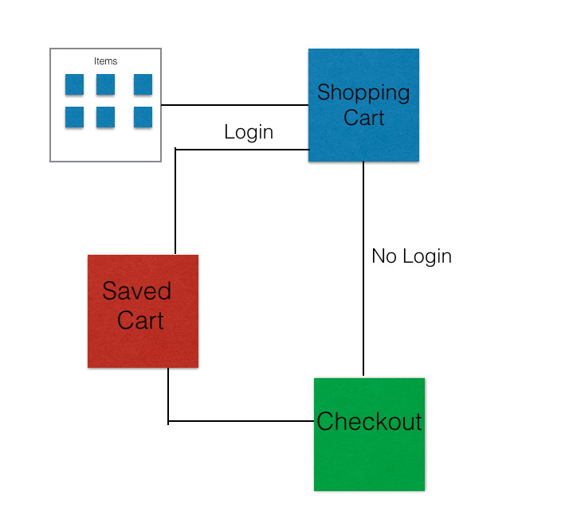

# RANA Organics  

## Overview

Grocery Shopping can be a pain! Long lines, overwhelming variety of products. Being healthy is also tough - not as easy an access as the bag of crisps at a local CVS. Rana Organics is the solution to both problems - an ecommerce website for organic, substainable food products, delivering products right at your doorstep. 


## Data Model


An Example User:

```javascript
{
  user: "anandinichawla",
  hash: // a password hash,
  shoppingCart: // an array of references to items selected 
  payment: //payment made or not (true or false) 
}
```

A Schema for products on site:

```javascript
{
  imagePath: String, required: true 
  title: String, required: true
  description: String, required: true
  price: String, required: true

}
```

## Wireframes


Items Listed


page for items added to shopping cart


Option for Checkout 


Sign In page 


Payment 


## Site map

The site map is subject to change as the project progresses.



## User Stories or Use Cases


1. as non-registered user, I can register a new account with the site
2. as a user, I can log in to the site
3. as a user, I can add items to my shopping cart
4. as a user, I can view items saved to my shopping cart
5. as a user or non-registered user I can place my order 


## Research Topics


* (5 points) Integrate user authentication
    * I'm going to be using passport for user authentication.
    * User will be of one type - guest or logged in
    * Testing has not been done yet
    * Possible implementation of signing with facebook or gmail logins 
* (4 points) Unit Testing
 * I will be unit testing with mocha 
 * I will unit test for logins and other functionalities of the user
* (2 points) CSS Framework
    * I will use bootstrap 
    * I will try to make the website responsive 
* (4 points) Per External API integration 
    * Stripe Payment Views 
    * I will add a payment checkout system 

14 points total out of 8 required points


## [Link to Initial Main Project File](/src/app.js) 


## Annotations / References Used


1. [passport.js authentication docs](http://passportjs.org/docs) 
2. [tutorial on bootstrap](https://getbootstrap.com/docs/4.0/getting-started/introduction/) 
3. [mocha unit testing](https://github.com/mochajs/mocha) 
4. [Stripe API](https://dashboard.stripe.com/register)