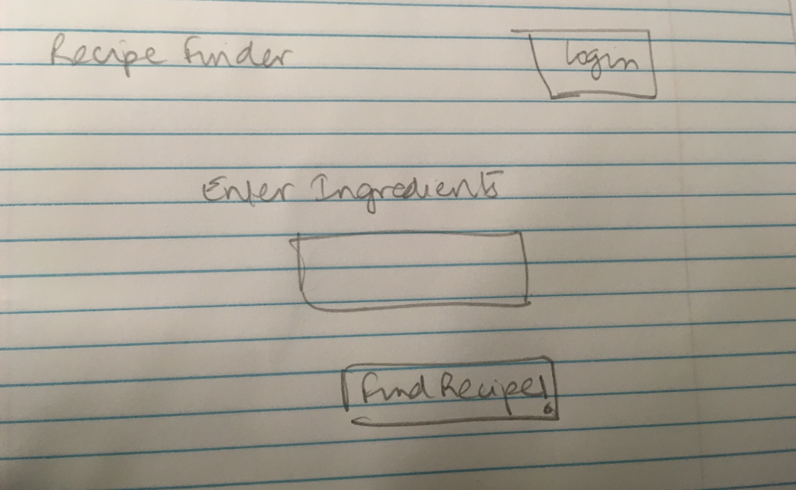

# Recipe  Finder 

## Overview


Figuring out what to eat can be a difficult task! The solution: receipe finder. 
Receipe Finder can help you find receipes based on the ingredients you have at home. These recipes will most
closely match your specifications. 


## Data Model


An Example User:

```javascript
{
  username: "anandinichawla",
  hash: // a password hash,
  lists: // an array of references to List saved receipes 
}
```

An Example List with Embedded Items:

```javascript
{
  user: // a reference to a User object
  name: "Breakfast foods",
  items: [
    { name: "pancakes", tags: eggs, flour, },
    { name: "avocado-smash", tags: healthy, sandwich, },
  ],
  createdAt: // timestamp
}
```


## Wireframes


/list/create - page for creating a new shopping list


/list - page for showing all shopping lists



/list/slug - page for showing specific shopping list


## Site map

The site map is subject to change as the project progresses.
(documentation/Sitemap.png)


## User Stories or Use Cases

(___TODO__: write out how your application will be used through [user stories](http://en.wikipedia.org/wiki/User_story#Format) and / or [use cases](https://www.mongodb.com/download-center?jmp=docs&_ga=1.47552679.1838903181.1489282706#previous)_)

1. as non-registered user, I can register a new account with the site
2. as a user, I can log in to the site
3. as a user, I can enter ingredients and find recipes 
4. as a user, I can save recipes if logged in
5. as a user, I can add view my saved recipes
6. as a user, I can delete recipes

## Research Topics

(___TODO__: the research topics that you're planning on working on along with their point values... and the total points of research topics listed_)

* (5 points) Integrate user authentication
    * I'm going to be using passport for user authentication.
    * User will be of one type - guest or logged in
    * Testing has not been done yet
    * Possible implementation of signing with facebook or gmail logins 
* (4 points) Unit Testing
 * I will be unit testing with mocha 
 * I will unit test for logins and other functionalities of the user
* (2 points) CSS Framework
    * I will use bootstrap 
    * I will try to make the website responsive 

10 points total out of 8 required points


## [Link to Initial Main Project File](app.js) 

initial main project has been added on this git repo 

## Annotations / References Used


1. [passport.js authentication docs](http://passportjs.org/docs) 
2. [tutorial on bootstrap](https://getbootstrap.com/docs/4.0/getting-started/introduction/) 
3. [mocha unit testing] (https://github.com/mochajs/mocha) 